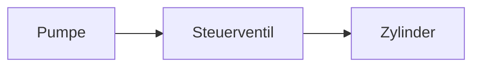

# Schema: Inhalts-Markdown pro Lernsituation

Pro Lernsituation eine `.md` im Obsidian-Vault. Diese Datei ist die
**Quelle** für den Wizard und für die Stundenplan-Aufgaben-Zuordnung:
der Lehrer pflegt sie in Obsidian, App und Wizard lesen sie.

Pfad im Vault:
`<vault_subpath>/<smb_folder_name>.md`
Beispiel: `vault/LS-0042_hydraulik-grundlagen.md`

**Aktuelles Schema: v2.** Schema v1 (alte Sektionsliste) bleibt lesbar,
neue Vorlagen werden aber als v2 angelegt. Aufgaben-Sync und
Stundenplan-Zuordnung funktionieren nur mit v2.

---

## Aufbau (v2)

```markdown
---
ls_id: 42
slug: hydraulik-grundlagen
display_name: Hydraulik Grundlagen
klasse: MTA22
lernfeld: LF07
created: 2026-06-05
updated: 2026-06-06
schema_version: 2
---

# Hydraulik Grundlagen

## 1. Lernsituationsbeschreibung

### Szenario / Auftrag
„Du bist Mechatroniker:in im Werk Süd. Die Hydraulikpresse Nr. 7 …"

### Lernziele
- Die SuS können die hydraulische Grundgleichung anwenden.
- Die SuS unterscheiden Volumenstrom, Druck und Kraft.

### Vorwissen / Anknüpfung
Druck und Kraft aus LF03 bekannt. Hydraulikschaltzeichen noch nicht
eingeführt.

## 2. Phasen der vollständigen Handlung

### Aufgabe 1: Pumpe identifizieren
*Phasen:* Informieren, Planen

Auftragstext im Imperativ. Material: Datenblätter. Sozialform: Partner.

#### Lösungsskizze
Pumpe ist eine Zahnradpumpe. Typische Fehler: Verwechslung mit
Kreiselpumpe.

### Aufgabe 2: Schaltung aufbauen
*Phasen:* Ausführen

…

#### Lösungsskizze
…

### Aufgabe 3: Funktion prüfen
*Phasen:* Kontrollieren, Bewerten

…

#### Lösungsskizze
…

## 3. Anmerkungen
Freier Notizblock — Erfahrungen aus dem Lauf, Material-Tipps für die
nächste Klasse, was beim nächsten Mal anders.

---

## Erzeugte Materialien
*Vom Wizard automatisch befüllt — pro Generierung ein Block.*

<!-- WIZARD-BLOCK · 2026-06-06 10:15 · Arbeitsblatt -->
…
```

---

## Pflichtsektionen

Folgende Sektionen müssen vorhanden und befüllt sein:

- `## 1. Lernsituationsbeschreibung`
  - `### Szenario / Auftrag`
  - `### Lernziele`
  - `### Vorwissen / Anknüpfung`
- `## 2. Phasen der vollständigen Handlung`
  - **mindestens eine** `### Aufgabe N: <Titel>`
- `## 3. Anmerkungen` *darf leer sein*

Fehlen welche, zeigt der Wizard ein gelbes Banner. Die Generierung läuft
trotzdem; das Ergebnis wird aber dünner.

---

## Aufgaben-Sektion im Detail

### Header-Format
`### Aufgabe N: <Titel>` — `N` als Zahl, Titel frei.

Aus dem Header wird automatisch:
- **Nummer** (für DB-Identität + Stundenplan-Anzeige „Aufg. 2, 3")
- **Anker** `aufgabe-N` (für Deep-Links)
- **Titel** (für Übersicht)

### Phasen-Tag (optional)
Direkt unter dem Aufgabenheader:

```markdown
*Phasen:* Informieren, Planen
```

Erkannt wird auch: `*Phase:*`, `_Phasen:_`, mit/ohne Bold-Sterne.
Erlaubte Phasen (vollständige Handlung):

> Informieren · Planen · Entscheiden · Ausführen · Kontrollieren · Bewerten

Die Phasen werden im LS-Detail als Pillen angezeigt und im
Aufgaben-Picker des Stundenplans neben dem Titel sichtbar.

### Lösungsskizze pro Aufgabe
`#### Lösungsskizze` direkt unter der Aufgabe.

Wird beim Aufgaben-Parse als separates Feld erfasst und im
Stundenplan-Picker als ausklappbarer Bereich angezeigt — du siehst die
Lösung im Block ohne Obsidian-Wechsel.

---

## Aufgaben ↔ Stundenplan

Im Stundenplan-Panel jedes Blocks gibt es **„Aufgaben aus
Lernsituation"**:

1. Lernsituation auswählen (vorgefiltert auf passende Klasse).
2. Aufgaben per Checkbox auswählen.
3. Speichern.

Im Grid erscheint im betreffenden Block eine kleine Pille `Aufg. 2, 3`.

Die DB-Tabelle `ls_aufgaben` ist nur ein **Index** — die Wahrheit ist
die MD. Wenn du in Obsidian Aufgabe 3 löschst oder umbenennst, sync't
die App das automatisch beim nächsten Öffnen:

- Neue Aufgaben in der MD → erscheinen im Picker.
- Gelöschte Aufgaben in der MD → werden auch aus den Stundenplan-
  Verknüpfungen entfernt (CASCADE).
- Vertauschte Nummern → Wizard hält die DB-Identität an der **Nummer**
  fest; bestehende Stundenplan-Verknüpfungen folgen der Nummer.

---

## YAML-Frontmatter

| Feld           | Pflicht | Beschreibung |
|---|---|---|
| `ls_id`        | ja      | DB-ID, vom Wizard gesetzt |
| `slug`         | ja      | URL-Slug, immutable |
| `display_name` | ja      | Anzeigename, vom Wizard bei Rename aktualisiert |
| `klasse`       | nein    | z. B. `MTA22` |
| `lernfeld`     | nein    | z. B. `LF07` |
| `created`      | ja      | Anlegedatum |
| `updated`      | ja      | Letzte Wizard-Berührung |
| `schema_version` | ja    | aktuell `2` |

Eigene Felder (z. B. `tags`, `pruefungsrelevant`) werden ignoriert und
nicht überschrieben.

---

## Mermaid und LaTeX

Beides erlaubt — Obsidian und die App rendern es:

```markdown
$$F = p \cdot A$$
```

````markdown

````

---

## Vorlage anlegen

Im Wizard Schritt 1 gibt es den Button **„Vorlage in Obsidian
anlegen"**. Der Wizard schreibt das v2-Skeleton (Frontmatter +
Pflichtsektionen + 1 Beispiel-Aufgabe + Hilfekommentare) in den Vault.
Danach in Obsidian Desktop öffnen und befüllen.

---

## Anhang: Schema v1 (Legacy)

Bis Juni 2026 wurde Schema v1 verwendet:

```markdown
## Lernziele
## Sachanalyse
## Inhalt
## Vorwissen / Anknüpfung
## Didaktischer Schwerpunkt
## Aufgabenideen
## Materialhinweise
## Quellen
```

v1-LS bleiben funktionsfähig — der Wizard generiert Material-Prompts
auch aus v1-Inhalten. **Aufgaben-Sync und Stundenplan-Zuordnung
funktionieren aber nur mit v2.**

Im Wizard Schritt 1 bietet die App bei v1-LS einen Button
„Schema v2 anlegen (überschreibt v1)". Vorher die alten Inhalte in
Obsidian sichern.
