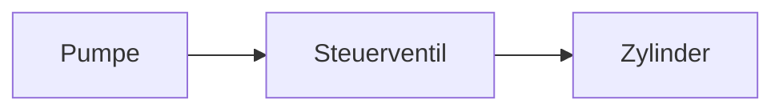

# Schema: Inhalts-Markdown pro Lernsituation

Pro Lernsituation eine `.md` im Obsidian-Vault. Diese Datei ist die
**Quelle** für den Wizard: der Lehrer pflegt sie in Obsidian, der Wizard
liest sie und erzeugt daraus Unterrichtsmaterialien (Arbeitsblatt,
Lösungsblatt, Tafelbild, …).

Pfad im Vault:
`<vault_subpath>/<smb_folder_name>.md`
Beispiel: `vault/LS-0042_hydraulik-grundlagen.md`

---

## Aufbau

```markdown
---
ls_id: 42
slug: hydraulik-grundlagen
display_name: Hydraulik Grundlagen
klasse: MTA22
lernfeld: LF07
created: 2026-06-05
updated: 2026-06-05
schema_version: 1
---

# Hydraulik Grundlagen

## Lernziele
- Die SuS können die hydraulische Grundgleichung anwenden.
- Die SuS unterscheiden Volumenstrom, Druck und Kraft.
- …

## Sachanalyse
Der fachliche Kern in eigenen Worten. Welche Begriffe stehen im Zentrum?
Welche Zusammenhänge sind tragend? Welche typischen Fehlvorstellungen
hast du bei deinen SuS schon erlebt?

## Inhalt
Was wird konkret unterrichtet? Stoffabfolge, Kernbeispiele, ggf. eine
kleine Schaltzeichnung (Mermaid oder ASCII) oder Tafelbild-Skizze.

## Vorwissen / Anknüpfung
Was bringen die SuS aus LF03/LF05 mit? Was haben wir letzte Woche
gemacht? Optional.

## Didaktischer Schwerpunkt
Methodische Wahl (Stationenlernen? Erkundungs-Phase? Lehrer-Demo?),
Phasierung, geplante Sozialformen. Optional.

## Aufgabenideen
Stichpunkte oder ausformulierte Aufgaben-Drafts mit kurzem
Erwartungshorizont. Wenn du schon konkrete Ideen hast, schreibe sie hier
auf — der Wizard nutzt sie. Optional.

## Materialhinweise
Realbauteile, Simulationen, Software, Werkzeuge, ggf. Datenblätter.
Optional.

## Quellen
Lehrwerke, DIN-Normen, Hersteller-Datenblätter, Lehrplan-Bezug.
Optional.

---

## Erzeugte Materialien

*Vom Wizard automatisch befüllt — pro Generierung ein Block. Bitte
nicht von Hand bearbeiten, lieber im Wizard neu erzeugen.*

<!-- WIZARD-BLOCK · 2026-06-05 14:23 · Arbeitsblatt -->
… (vom Wizard eingefügter Output)

<!-- WIZARD-BLOCK · 2026-06-05 14:45 · Lösungsblatt -->
… (vom Wizard eingefügter Output)
```

---

## Sektions-Regeln

### Pflicht-Sektionen

Folgende `## …`-Überschriften müssen vorhanden und befüllt sein (nicht
nur Kommentare):

- **Lernziele**
- **Sachanalyse**
- **Inhalt**

Fehlen sie, warnt der Wizard mit gelbem Banner — die Generierung läuft
trotzdem, aber das Ergebnis wird thin.

### Optionale Sektionen

- **Vorwissen / Anknüpfung**
- **Didaktischer Schwerpunkt**
- **Aufgabenideen**
- **Materialhinweise**
- **Quellen**

### Reihenfolge

Sektionen dürfen in beliebiger Reihenfolge stehen, der Parser sucht nach
Header-Text (case-insensitive, „/" und Umlaute toleriert).

### Output-Sektion

`## Erzeugte Materialien` wird vom Wizard angelegt, falls noch nicht da.
Pro Generierung hängt der Wizard einen Block der Form

```
<!-- WIZARD-BLOCK · YYYY-MM-DD HH:MM · <Typ> -->
<Output>
```

ans Ende an. Diese Blöcke kannst du bedenkenlos löschen — die Inhalts-
Sektionen oben bleiben unberührt.

---

## YAML-Frontmatter

| Feld           | Pflicht | Beschreibung |
|---|---|---|
| `ls_id`        | ja      | Datenbank-ID, vom Wizard gesetzt |
| `slug`         | ja      | URL-Slug, immutable |
| `display_name` | ja      | Anzeigename — wird vom Wizard bei Rename aktualisiert |
| `klasse`       | nein    | z. B. `MTA22` |
| `lernfeld`     | nein    | z. B. `LF07` |
| `created`      | ja      | Anlegedatum |
| `updated`      | ja      | Letzte Wizard-Berührung |
| `schema_version` | ja    | aktuell `1` |

Felder, die du selbst ergänzen willst (z. B. `tags`, `kapitel`,
`pruefungsrelevant`), werden vom Parser ignoriert und überschrieben nicht.

---

## Mermaid und LaTeX

Beides ist erlaubt — Obsidian und die App rendern es:

```markdown
$$F = p \cdot A$$


```

---

## Vorlage anlegen

Im Wizard Schritt 1 gibt es den Button **„Vorlage in Obsidian anlegen"**.
Der Wizard schreibt das Skeleton (Frontmatter + leere Sektionen + Beispiel-
Kommentare) in den Vault. Danach öffne die Datei in Obsidian Desktop und
befülle die Pflichtsektionen — zurück im Wizard zeigt das Validierungs-
Banner dann grün.
